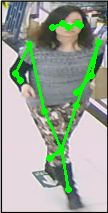

# pedestrian-pose-estimation

## Introdution

A [pytorch](https://github.com/pytorch/pytorch) implemented for pedestrian pose recognition base. 

This is a basic engineering code, you can add or delete some content according to your own needs, so as to achieve the appearance you want.

For example, to increase the network structure, you need to add network files in src/models; to modify the option parameters, you can modify them in options/options.

## Directory

- ### ```dataset```
The data set file, which contains image path.
  
  ```
  test.png
  ```
  
- ### ```image```
  
  The image files and json files of pose labels.
  
- ### ```model```

  The model of pre-trained or want to store.


- ### ```output```

  The log file in train or test process.

- ### ```src```
>- ```data```:  load data.
>- ```options```: parameters.
>- ```loss```: loss functions.
>- ```models```: networks.
>- ```util```: utils.
>- ```train.py```: train model.
>- ```deploy.py```: test model.

## Train

You should modify the options.py firstly, and then:

```python
python train.py
```

## Test

You should modify the options.py firstly, and then:

```python
python deploy.py
```

and then, you will get the image by drawing joints, for example:



## Reference

- [human-pose-estimation.pytorch](https://github.com/microsoft/human-pose-estimation.pytorch)

  
